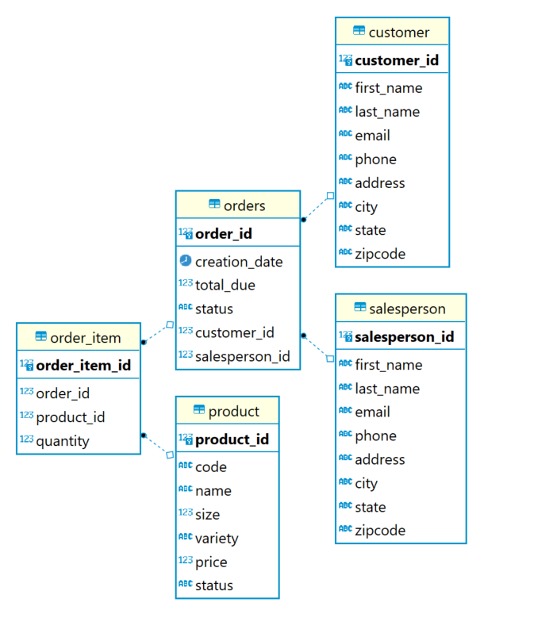
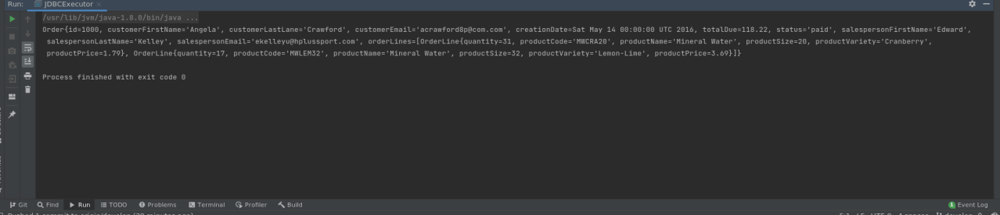

# Introduction
This project uses JDBC to establish a connection between java Application and a Postgres database running on a docker container using postgres image to implement CRUD operations on sales order information using DAO patterns.

# Implementation
## ER Diagram

## Design Patterns
This application uses DAO (Data Access Object) pattern which is an abstraction of data persistence and is considered closer to the underlying storage, which is often table-centric.
Therefore, in many cases, our DAOs match database tables, allowing a more straightforward way to send/retrieve data from storage, hiding the ugly queries.

The other pattern commonly used is a Repository Pattern, which is a layer between the Business layer and the Data layer used mainly to aggregate data from different
sources allowing to avoid the use of the same repeating code. In other words, a repository also deals with data and hides queries similar to DAO. However, it sits at a higher level, closer to the business logic of an app.

Selection of pattern depends on the business objectives and type of data processing needs to be done. Generally, the repository pattern encourages a domain-driven design, providing an easy understanding of the data structure for non-technical team members whereas DAO is intended towards technical auidence.

# Test
The PostgreSQL server created using Docker container was populated with the sample data using the sql scripts.
Using JDBCExecutor.java, a connection was established with Postgres Server. The application uses CustomerDAO and OrderDAO to do CRUD operations using the sample data created using Customer and Order objects.

